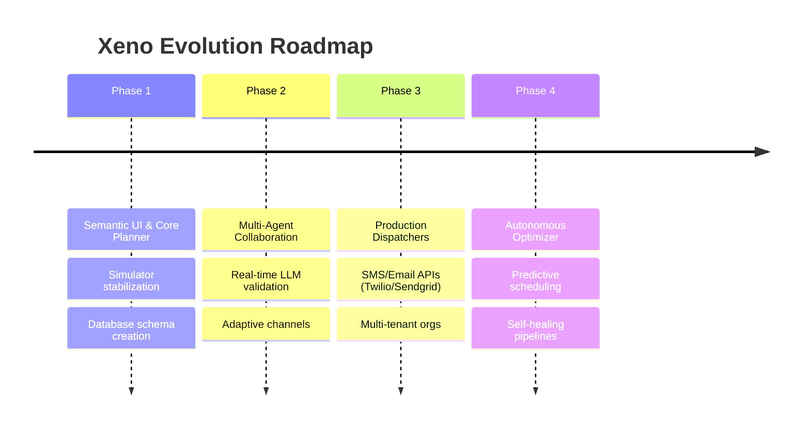

# Xeno: Autonomous AI-Native Marketing Workspace
## Executive Summary & Strategic Overview

---

## Vision
To redefine the relationship between brands and customers by replacing rigid, rule-based marketing systems with an autonomous, empathetic, and self-improving marketing brain that respects consumer attention and optimizes conversion without human intervention.

## Mission
To build a world-class, closed-loop campaign engine that translates business goals into hyper-personalized customer journeys, executes them across multi-channel networks in real time, and continuously learns from delivery and purchasing signals to refine its strategy automatically.

---

## The Problem Statement
Traditional Customer Relationship Management (CRM) and Marketing Automation platforms (e.g., Salesforce Marketing Cloud, HubSpot, Braze) suffer from three structural deficiencies:

1. **Rule-Based Fragility:** Campaigns rely on manual, hardcoded workflows ("if user opens email, wait 3 days, send SMS"). These flows become unmanageable as consumer segments grow, leading to over-messaging, fatigue, and opt-outs.
2. **Disconnected Insights:** Analytics are retrospective. Marketers review performance dashboards days or weeks after execution, failing to feed conversion signals back into audience selection or copy generation loops.
3. **Execution Latency:** Setting up a personalized, multi-channel campaign requires cross-functional coordination between data analysts (for segments), copywriters (for templates), and operations teams (for execution). This cycle takes days, missing critical consumer behavioral windows.

---

## The Solution: Xeno AI Copilot
Xeno is a fully autonomous, AI-native marketing platform built on three core pillars:
* **The Intelligence Copilot:** An agentic interface where marketers express campaign goals in plain English (e.g., "Recover high-value cart abandoners with a 10% coupon"). The Copilot formulates SQL-ready audience segments, writes personalized templates, selects optimal dispatch channels, and estimates ROI in under 10 seconds.
* **The Digital Twin Simulator:** A testing and execution environment that simulates realistic customer touchpoints and callback states to validate campaign performance before launching to real networks.
* **The Closed-Loop Feedback Engine:** A telemetry pipeline that matches asynchronous message receipt events (SENT -> DELIVERED -> READ) with real-time customer purchasing records, adjusting model recommendations via memory loop reinforcement.

---

## Key Differentiators
* **Zero-Copy Personalization:** Instead of pre-baking standard templates, Xeno generates message copy dynamically per customer context, resolving placeholders safely.
* **Autonomous Attribution:** Direct integration between CRM ledger tables and campaign receipt status enables exact revenue recovery attribution down to the penny.
* **Soft Stone Aesthetic:** A design system focused on extreme professionalism, dark/light parity, and visual comfort, avoiding game-like or amateurish dashboard elements.

---

## Target Users
* **Growth Marketing Teams:** Who need to spin up and test hundreds of micro-campaigns without relying on data engineers for SQL queries.
* **Marketing Operations Directors:** Seeking to consolidate duplicate segment queries, message builders, and analytics tools into a single, clean workspace.
* **Product & Engineering Leaders:** Building AI-integrated software who require highly observable, type-safe backend integrations and structured database logs.

---

## Business Impact
* **Reductions in Churn:** Dynamic channels prevent over-messaging by prioritizing the customer's high-responsiveness platform (e.g., opting for Email over intrusive SMS).
* **Increased Campaign Velocity:** Campaign ideation to active simulation pipeline is reduced from 4 days to 30 seconds.
* **Predictable ROI:** The system estimates ROI and confidence scoring during formulation, rejecting low-confidence campaigns before execution.

---

## Technical Highlights
* **Agentic Planner Architecture:** Deconstructs campaign goals into concrete steps (Segment identification, Historical Analysis, Channel Recommendation, Message Selection).
* **Prisma SQLite Ledger Schema:** Eventual-consistency ledger design matching recipients with immutable UUID channels and delivery states.
* **Modern React + Vite Frontend:** Pure CSS-variable design tokens for border definitions and zero-shadow visual fidelity.

---

## Competitive Advantages
* **Immediate Feedback Loop:** Unlike legacy systems where marketing is separated from transactions, Xeno connects both inside the same database transaction scope.
* **Built-in Channel Simulators:** Simplifies QA by allowing engineers to test end-to-end webhook callbacks locally.
* **Agentic Memory Persistence:** Successful campaigns feed context rules back into the next action engine, ensuring the AI gets smarter over time.

---

## Long-term Roadmap

* **Phase 1 (Current):** Semantic Design system completed. Closed-loop simulator pipeline running on local SQLite databases.
* **Phase 2 (Next 6 Months):** Multi-agent reasoning loops. The Planner will consult secondary agents (e.g., compliance agent, brand voice agent) before generating campaigns.
* **Phase 3 (Next 12 Months):** Real-world dispatchers (Twilio, SendGrid, WhatsApp Business APIs) with token-bucket rate limiters and user role authentications.
* **Phase 4 (Next 18 Months):** Autonomous Optimizer. The system runs independent micro-campaigns on autopilot, adjusting budget and channel weights continuously.
