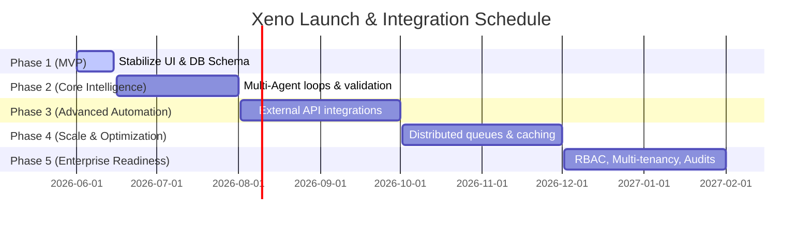

# Xeno Integration & Launch Roadmap

This document outlines the phased roll-out plan for the Xeno AI-native marketing platform. It transitions the application from a localized simulator MVP into a high-scale, multi-tenant enterprise system.

---

## Five-Phase Roll-out Overview

---

## Phases Breakdown

### Phase 1: MVP (Completed & Stabilized)
* **Goal:** Standardize the semantic theme engine, configure SQLite ledgers, and establish local delivery simulator loops.
* **Features:**
  * AI Copilot formulation panel.
  * Live monitoring dashboards with animated counters.
  * Customer directories showing order categories.
* **Deliverables:** Working React/Express codebases using local SQLite ledgers.
* **Success Metrics:** Zero hardcoded slate/indigo style leakages; consistent dark/light mode switches.

---

### Phase 2: Core Intelligence & Multi-Agent Loops
* **Goal:** Enhance LLM reasoning checks and prompt safety pipelines.
* **Features:**
  * **Multi-Agent Planners:** A secondary auditor agent checks generated copy templates against compliance guidelines.
  * **Interactive Preview Mockups:** Marketers edit generated SMS or WhatsApp templates and observe visual updates immediately.
* **Dependencies:** Stable LLM endpoints; JSON output schema validations.
* **Risks:** LLM latency; prompt injection vulnerabilities.
* **Success Metrics:** Formulation latency remains under 8 seconds; 100% type-safe JSON returns.

---

### Phase 3: Advanced Automation & Live Channels
* **Goal:** Connect Xeno to real delivery networks (Twilio, SendGrid, Mailchimp) while adding token-bucket rate limiters.
* **Features:**
  * Live SMS, Email, and WhatsApp dispatch providers.
  * Robust webhook callback parsers with signature verifications.
* **Dependencies:** API keys from dispatch platforms; public endpoint hosting for incoming webhooks.
* **Risks:** Dispatch API price spikes; callback volume spikes.
* **Success Metrics:** Dispatch queues process 5,000 dispatches per minute; webhook handler response time under 100ms.

---

### Phase 4: Scale, Caching & Performance (PostgreSQL Migration Completed)
* **Goal:** Transition database layers and introduce memory caches to handle millions of customer records.
* **Features:**
  * Migrate database from SQLite to PostgreSQL (Completed & Deployed to Neon PostgreSQL).
  * Deploy Redis layers to cache customer segments and user state values.
  * Transition dispatches to distributed queue architectures (e.g. BullMQ or Celery).
* **Dependencies:** Neon PostgreSQL setup (Done), Redis instances.
* **Risks:** Database deadlocks; cache synchronization lag.
* **Success Metrics:** Database queries run in under 50ms; system supports 10 million customer rows.

---

### Phase 5: Enterprise Readiness
* **Goal:** Support organizational isolation, role-based access control (RBAC), and security logging.
* **Features:**
  * Multi-Tenant Organization workspaces.
  * SSO Integrations (SAML / OIDC).
  * Administrative Audit Logging.
* **Dependencies:** Auth0 or Supabase Auth integrations.
* **Risks:** Configuration drift; cross-tenant data leaks.
* **Success Metrics:** SOC2 Type II compliance audit passed; 100% data separation between organizations.
