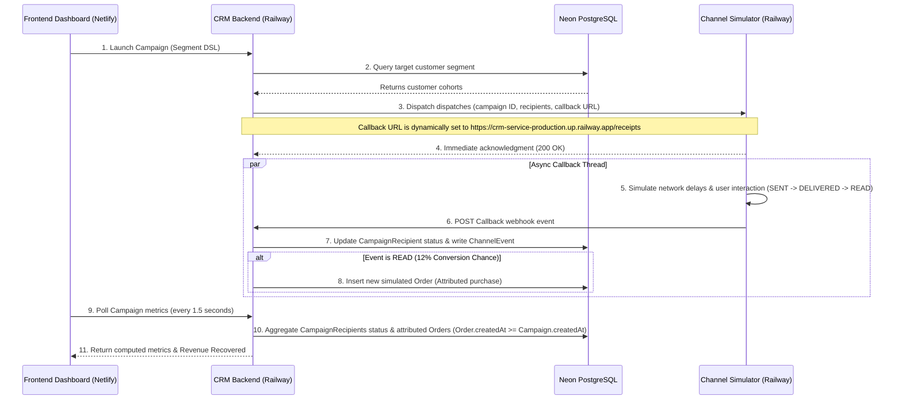

# Xeno Production Deployment & Campaign Attribution Setup

This document describes the production deployment configuration, multi-service hosting setup, and telemetry fixes implemented to support live closed-loop campaign tracking and attribution.

---

## Live Services Registry

Xeno is deployed as a distributed system across three production environments:

| Service | Hosting Platform | URL | Purpose |
| :--- | :--- | :--- | :--- |
| **Frontend Dashboard** | Netlify | `https://xeno-production.netlify.app` | React single-page app interface for marketers. |
| **CRM Backend** | Railway | `https://crm-service-production.up.railway.app` | Express API, campaign analytics engine, and Prisma interface. |
| **Channel Simulator** | Railway | `https://channel-simulator-production.up.railway.app` | Microservice executing asynchronous message dispatches and tracking webhooks. |
| **Database Ledger** | Neon | *(Managed Cloud)* | High-performance PostgreSQL cluster. |

---

## Production Architecture & Data Flows



---

## Environment Variables Configuration

### 1. Frontend Dashboard (Netlify)
* `VITE_API_URL`: `https://crm-service-production.up.railway.app` (Points to the live Railway CRM API)
* `VITE_SIMULATOR_URL`: `https://channel-simulator-production.up.railway.app` (Points to the live Channel Simulator)

### 2. CRM Backend (Railway)
* `DATABASE_URL`: `postgresql://...` (Neon PostgreSQL production connection string)
* `PORT`: `8080` (Automatically assigned by Railway)
* `FRONTEND_URL`: `https://xeno-production.netlify.app` (Used for CORS policy configuration)
* `SIMULATOR_URL`: `https://channel-simulator-production.up.railway.app` (Tells backend where to send launch payloads)
* `BACKEND_URL`: `https://crm-service-production.up.railway.app` (Used to configure callback target URL)

### 3. Channel Simulator (Railway)
* `PORT`: `8080`
* `FRONTEND_URL`: `https://xeno-production.netlify.app`

---

## Technical Implementations & Bug Fixes

### 1. Dynamic Webhook Callback Routing
* **Problem:** The CRM backend previously generated a hardcoded callback URL of `http://localhost:8000/receipts` when dispatching campaign records to the simulator. Consequently, in production, the Channel Simulator attempted to post updates back to its own localhost, causing all callbacks to fail and campaigns to stay perpetually in a `$0` ROI state.
* **Solution:** Replaced the hardcoded URL with dynamic URL resolution inside [launch.service.ts](../crm-service/src/services/launch.service.ts). It checks for `process.env.BACKEND_URL` and `process.env.RAILWAY_STATIC_URL` before falling back to localhost.
```typescript
let backendUrl = process.env.BACKEND_URL;
if (!backendUrl && process.env.RAILWAY_STATIC_URL) {
  backendUrl = `https://${process.env.RAILWAY_STATIC_URL}`;
}
if (!backendUrl) {
  backendUrl = `http://localhost:${config.port}`;
}
const callbackUrl = `${backendUrl.replace(/\/$/, '')}/receipts`;
```

### 2. Historical Conversion Realism in Seed Script
* **Problem:** Historical campaigns targeting specific customer groups (like "Dormant" segment campaigns) displayed `$0` in the Campaign History table. This happened because the database seeding script generated all customer orders *prior* to generating campaigns. Since the attribution engine only links orders placed *after* a campaign launch, no historical orders fell within the attribution window.
* **Solution:** Refactored [seed.ts](../crm-service/prisma/seed.ts) to defer order collection and database insertion. For historical campaign recipients whose message status is simulated as `READ`, the script generates a conversion order placed shortly after the simulated read event. This aligns order timestamps with campaign timelines, populating the registry with realistic and representative conversion figures.
