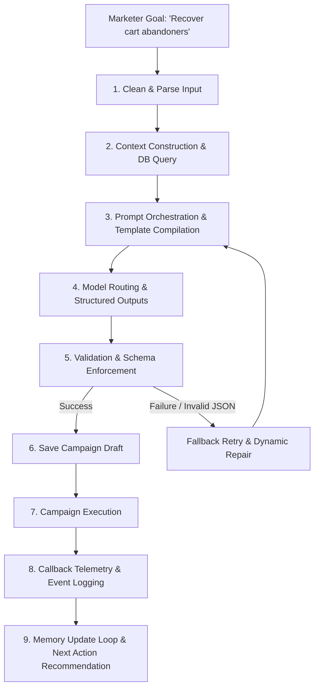

# Xeno AI Agentic Lifecycle & Prompt Orchestration

This document describes Xeno's AI pipeline, explaining how natural language inputs are transformed into optimized campaign templates and how real-time performance telemetry updates model memory loops.

---

## AI Processing Workflow Diagram



---

## The 9 Steps of the AI Lifecycle

### 1. Clean & Parse Input
The backend receives raw text prompts from the Copilot UI. A pre-processor sanitizes the text, striping dangerous control characters or malicious injection attempts while extracting named entities (e.g. segments mentioned, discounts, channels).

### 2. Context Construction
Before building the prompt, Xeno queries database repositories to fetch:
* **Active Customer Stats:** Total counts, active categories, order frequency.
* **Historical Campaign Performance:** Metrics from previous campaigns (open rates, conversion lifts, revenues).
* **Segment Sample Profiles:** Five representative customers to let the LLM understand standard purchase patterns.

### 3. Prompt Orchestration
A custom engine compiles the collected context variables into a structured prompt using JSON schemas. The prompt enforces:
* Strict output schemas (Structured JSON).
* Tone guidelines and character limit parameters.
* Placeholders validation rules (e.g. `{name}` is allowed, but `{last_purchase_date}` might not be supported).

### 4. Model Routing
Requests are routed to the Gemini API (`gemini-2.5-flash`). We leverage structured JSON output instructions to ensure the model responds with a schema matching:
```json
{
  "name": "Campaign Name",
  "segmentDsl": {
    "minAmount": 50,
    "category": "Latte"
  },
  "channel": "SMS",
  "messageTemplate": "Hey {name}, your Latte is waiting. Code: RECOVER10",
  "confidenceScore": 0.85,
  "estimatedRoi": 4.5
}
```

### 5. Response Validation & Repair
The API client checks the parsed response. If fields are missing, variables are empty, or the message template uses invalid tags, a retry script runs:
* **Self-Repair:** The validator feeds the bad response back to Gemini along with error logs (e.g. "JSON missing 'channel' property") to get a corrected structure.
* **Local Fallback:** If repairs fail after 2 retries, a safe template with default parameters is created, logging the failure status.

### 6. Campaign Registry
Once validated, the JSON campaign plan is saved to the SQLite Database with a `DRAFT` status, enabling preview in the frontend.

### 7. Campaign Execution
When launched, recipient dispatches are triggered. The channel recommendation determines the target platform (SMS, Email, WhatsApp).

### 8. Webhook Telemetry
Delivery states map the performance. The simulator updates recipient logs as delivery confirmations return.

### 9. Learning Loops & Next Actions
The final metrics feed the Next Action Engine, appending successful templates back into context for future campaigns.
