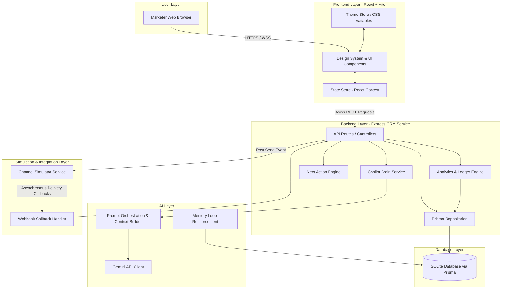

# Xeno System Architecture Blueprint

This document outlines the system architecture of Xeno, highlighting the separation of concerns across layers, the integration of the AI planner, and the closed-loop telemetry flow.

---

## System Architecture Diagram

---

## Architectural Components Explained

### 1. User Layer
* **Marketer Browser Interface:** The client window rendering the dashboard. It interacts with the platform via REST APIs, displaying real-time campaign creation tools, delivery charts, and customer lists.

### 2. Frontend Layer (React + Vite)
* **Design System & UI Components:** Core views structured into Copilot Planner, Campaign Registry, Live Monitor, and Customer Directory. Built with pure CSS variable tokens supporting high-fidelity Light/Dark mode transitions.
* **Theme Store:** Governs theme toggles. It mutates `document.documentElement`'s class list dynamically, changing variable colors instantenously without hardcoded style flickering.
* **State Store (React Context):** Lightweight React providers managing active campaigns, real-time log polling, and Copilot input.

### 3. Backend Layer (Express CRM Service)
* **Router & Controllers:** REST API entry points validating requests using Zod schemas and forwarding data to business services.
* **Copilot Brain Service:** Core coordinator managing campaign formulation steps (Segment selection, historical verification, copy writing, ROI math).
* **Next Action Engine:** Suggests context-relevant steps to the user based on database states (e.g. if draft campaigns exist, it prompts for launch review).
* **Analytics Engine:** Tallies campaign performance metrics (ROI, conversion, delivery ratios) dynamically from the database.

### 4. AI Layer
* **Gemini Service:** Connects to `gemini-2.5-flash` or similar models, ensuring type-safe JSON returns using structured outputs.
* **Prompt Orchestrator:** Formulates system/user prompts with context injectors (historical campaigns, segment counts, order distributions).
* **Memory Manager:** Synthesizes campaign feedback logs, creating memory rules to feed into subsequent planning loops.

### 5. Database Layer
* **Prisma SQLite Configuration:** Coordinates transactions, indexing, and object-relational mapping. Holds the target customer database, order ledgers, active campaigns, and campaign recipient state rows.

### 6. Simulation & Webhook Layer
* **Channel Simulator Service:** A separate running microservice that simulates active SMS/Email/WhatsApp delivery networks. It queues dispatches and sends asynchronous delivery status webhooks (`SENT`, `DELIVERED`, `READ`, `FAILED`) to simulate real-world API providers (e.g. Twilio).
