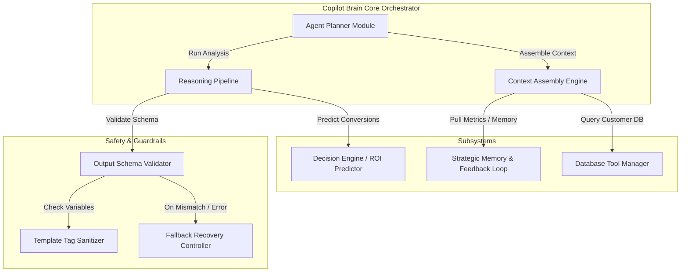

# Xeno Copilot Brain Architecture

The Copilot Brain is the central orchestration layer governing campaign generation, recommendation logic, and agent feedback. This document details its sub-modules, reasoning pipelines, and fallback strategies.

---

## Copilot Brain Blueprint

---

## Core Sub-Modules & Systems

### 1. Agent Planner Module
The Planner coordinates incoming user goals. Rather than executing a monolithic LLM prompt, it breaks down planning tasks into sequential steps:
* **Step A:** Parse the user's core intent.
* **Step B:** Filter matching audience segments using transaction ledgers.
* **Step C:** Choose the optimal communication channel vector.
* **Step D:** Write custom copywriting templates.
* **Step E:** Build ROI predictions and confidence ratings.

### 2. Context Assembly Engine
The Context Engine queries database repositories to fetch raw records and compile them into LLM-readable states. It fetches customer count tables, active order categories, and past campaign performance indexes.

### 3. Reasoning Pipeline & Decision Engine
Calculates expected conversions. The Decision Engine analyzes past campaigns matching the segment filters:
* If a similar segment responded well to SMS coupons, it skews the recommended channel score to SMS.
* If a segment has a high opt-out rate on WhatsApp, it shifts priority to Email.
* It multiplies average purchase amounts by segment size and conversion rates to predict estimated ROI.

### 4. Strategic Memory System
The Memory System maintains historical feedback loops. It reviews logs of completed campaigns:
* It identifies high-performing copywriting hooks (e.g. "We noticed you left something behind...").
* It extracts rules like: "Do not send SMS to users who haven't ordered in 90 days (low conversion)".
* These rules are saved as text guidelines in SQLite and injected directly into system prompts.

### 5. Tool Manager
Provides interfaces for the model to access database statistics safely. Rather than executing raw SQL, the Tool Manager translates LLM preferences into type-safe Prisma database queries.

---

## Safety, Guardrails & Fallbacks

### Safety Checks
* **Copy Sanitization:** Message templates must only use authorized curly-brace placeholders: `{name}` and `{cart_url}`. Any template referencing custom strings is rejected.
* **Profanity & Compliance Guards:** Filters generated content against toxic vocabulary lists.

### Fallback Strategies
In the event of network timeouts, API outages, or validation failures, the platform degrades gracefully:
1. **Dynamic JSON Reparsing:** If the model returns incomplete JSON, regex parsers isolate brackets and reconstruct missing fields.
2. **Schema Repair Prompts:** Sends the error back to Gemini for automated code corrections.
3. **Static Defaults:** If AI endpoints fail completely, a pre-compiled campaign plan is retrieved from local cache presets, allowing the marketer to proceed without service disruption.
