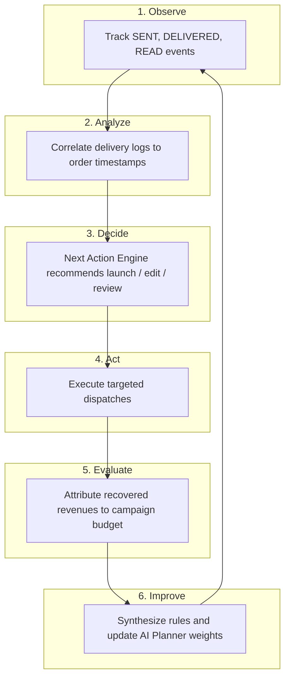

# Xeno Copilot V2: Closed-Loop OADA Engine

The Closed-Loop Engine drives continuous intelligence in Xeno. By constantly tracking delivery outcomes and transaction ledgers, the platform learns which strategies perform best and updates itself without manual configuration.

---

## The Closed-Loop Lifecycle (Observe-Analyze-Decide-Act-Evaluate-Improve)

---

## Core Stages Explained

### 1. Observe (Data Collection)
The platform logs delivery notifications for every targeted recipient:
* **Sent:** Dispatch success from the channel API.
* **Delivered:** Inbox confirmation.
* **Read:** Opening confirmation.
* **Failed:** Rejections, incorrect addresses, or API downtime.

### 2. Analyze (Performance Correlation)
Xeno matches campaign reads with subsequent customer purchase timestamps:
* **Conversion Window:** If a customer completes an order within 48 hours of reading a message, it is marked as campaign-attributable conversion.
* **Channel Efficiency:** Analyzes delivery vs read rates to measure message receptiveness (e.g. email has lower read rates but lower costs; SMS has higher read rates but higher opt-outs).

### 3. Decide (Next Action Insights)
Based on telemetry, the decision engine prompts the user with action recommendations:
* *Example:* If delivery rates fall below 80%, the system flags a "Delivery Quality Alert" suggesting segment filters.
* *Example:* If high conversions are registered, it recommends scaling budget allocations.

### 4. Act (Campaign Execution)
The marketer approves recommendations, triggering campaign formulation updates, segment refinements, or channel adjustments.

### 5. Evaluate (ROI Attribution)
Attribution is calculated mathematically:
$$\text{Campaign Revenue} = \sum (\text{Amounts of Completed Orders placed by Recipients within 48h window})$$
$$\text{ROI} = \frac{\text{Campaign Revenue} - \text{Campaign Dispatch Cost}}{\text{Campaign Dispatch Cost}}$$

### 6. Improve (Reinforcement Learning)
The Planner updates system memory weights:
* Copy hooks that converted are saved as recommended styles.
* Low-conversion cohorts are added to exclusionary lists for future campaigns.

---

## Confidence Scoring & Recovery

### Confidence Rating Model
The system calculates a confidence score ($0.0$ to $1.0$) during campaign design:
1. **Audience Fit ($35\%$):** Does the target segment match the campaign goal based on historical transactions?
2. **Channel Responsiveness ($35\%$):** How active is the target segment on the proposed channel?
3. **Template Quality ($30\%$):** How closely does the generated copy align with historical converting styles?

### Auto-Recovery Mechanisms
* **Simulated Dispatch Retries:** If simulator webhooks timeout, dispatches are automatically retried up to 3 times before registering a `FAILED` log.
* **DSL Safety Boundaries:** If audience segment SQL queries are slow or return empty cohorts, the database engine enforces fallback parameters (e.g. default VIP segment).
