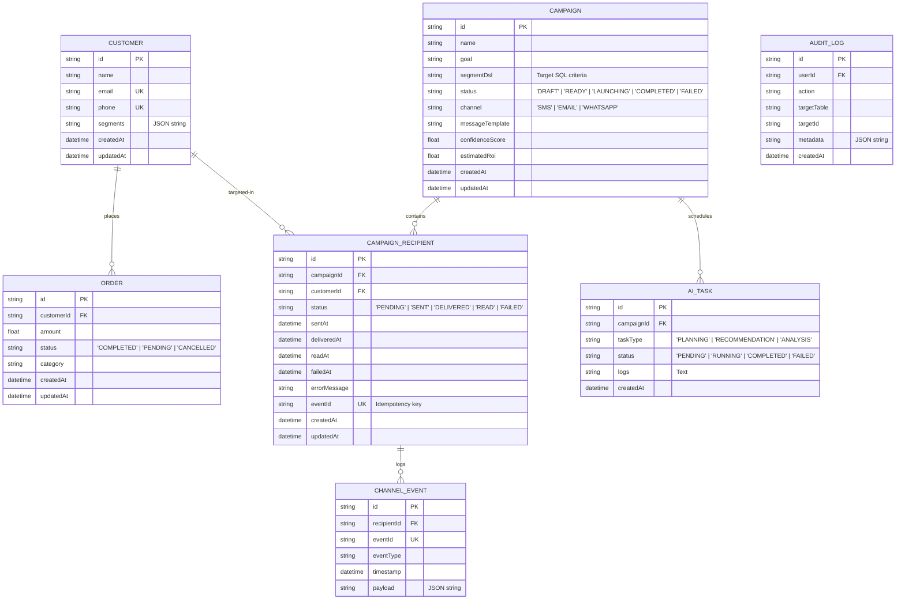

# Xeno Relational Data Schema (Entity Relationship)

This document describes the database design of Xeno, detailing fields, types, constraints, and relational schemas managed by Prisma SQLite.

---

## Entity Relationship Diagram

---

## Database Entities Explained

### 1. Customer
* **Purpose:** Represents customer profile info and demographic segmentation attributes.
* **Key Fields:**
  * `id` (UUID, Primary Key): Unique identifier.
  * `email` and `phone` (Unique Constraints): Prevent duplicate user generation.
  * `segments` (JSON string): Stores array of tag indicators (e.g. `["VIP", "Cart-Abandoner", "Espresso-Lover"]`).

### 2. Order
* **Purpose:** Transaction ledger tracks customer purchases, feeding directly into ROI attribution logic.
* **Key Fields:**
  * `customerId` (Foreign Key -> Customer): Links transaction to specific customer context.
  * `status`: Filters completed orders for attribution metrics.
  * `category`: Categorizes purchased items (e.g., Latte, Coffee Beans) to allow targeted product promotions.

### 3. Campaign
* **Purpose:** The core campaign object containing copy templates, recommended channel vectors, and AI-estimated confidence ratings.
* **Key Fields:**
  * `segmentDsl` (JSON): Simple target criteria definition (e.g. `{"minOrders": 3, "lastOrderDays": 60}`).
  * `status`: Controls screen states (e.g., launching campaigns lock edits).

### 4. CampaignRecipient
* **Purpose:** Join table linking customers to campaigns. Acts as the execution ledger tracker.
* **Key Constraints:**
  * Unique Composite Index on `[campaignId, customerId]`: Ensures a customer receives exactly one dispatch per campaign.
  * `eventId` (Unique): Acts as an idempotency validation token preventing double callback processing.

### 5. ChannelEvent
* **Purpose:** Diagnostic and auditing log detailing exact webhook payloads received from simulators or network providers.
* **Key Fields:**
  * `payload`: Full response payload logs, aiding debugs in event of dispatch failure.

### 6. AuditLog
* **Purpose:** Chronologically logs administrative actions (e.g. "Campaign Launched", "Theme Switched") for enterprise security reviews.

### 7. AITask
* **Purpose:** Tracks Gemini asynchronous requests and reasoning pipelines for observability and performance metrics.
