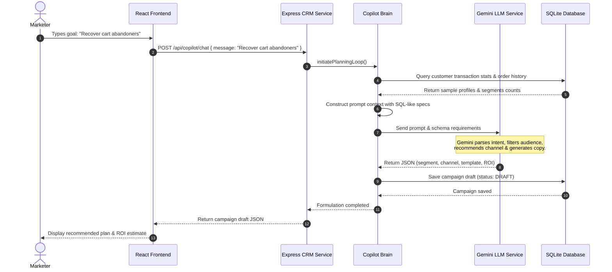
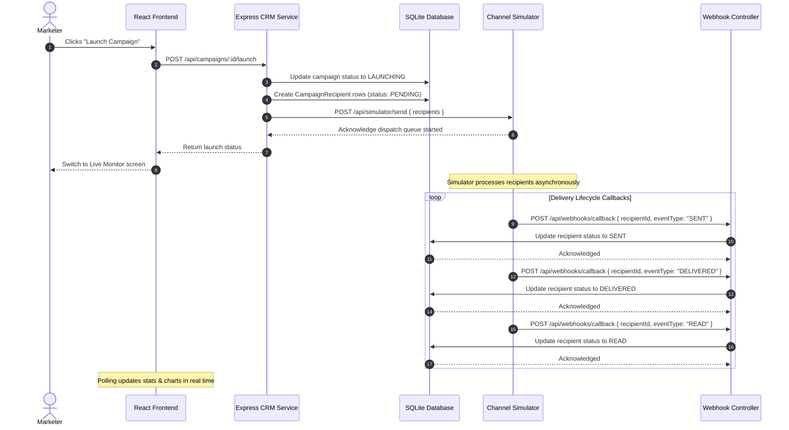
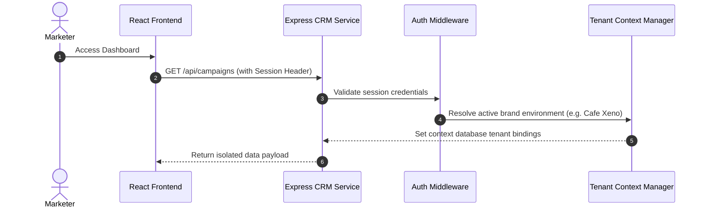
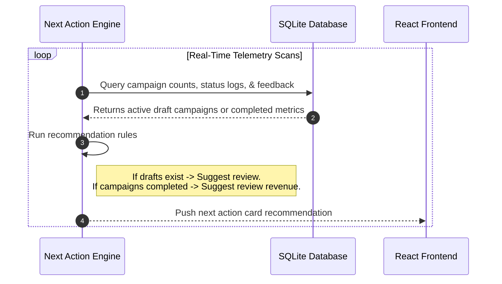
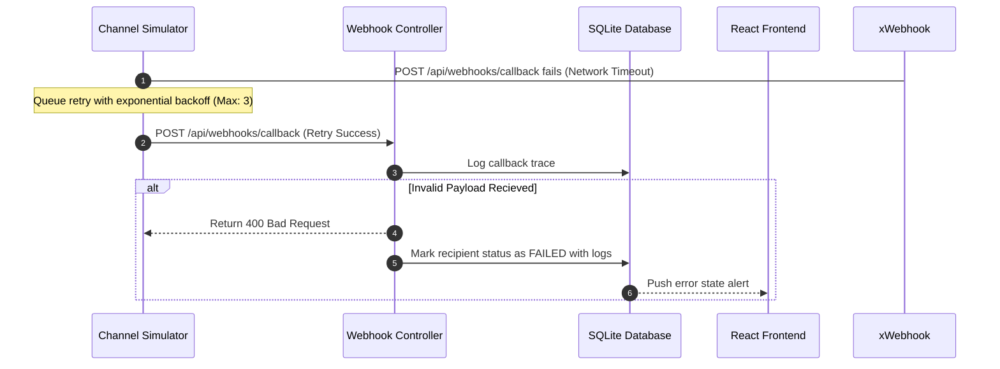

# Xeno Core Sequence Flows

This document details the step-by-step sequence diagrams governing major operational flows in Xeno.

---

## 1. AI Request Lifecycle & Campaign Formulation

This flow shows how a marketer's request is parsed, planned, and formulated by the AI Brain.

### Explanation
1. The marketer specifies the goal.
2. The frontend sends a chat request to the CRM service.
3. The Copilot Brain gathers background context from the database (segment sizes, categories, past campaigns).
4. The Brain builds a context-rich prompt and issues a structured JSON request to Gemini.
5. Gemini generates the campaign parameters which are saved as a DRAFT.
6. The frontend displays the proposal.

---

## 2. Closed-Loop Execution & Delivery Callbacks

This flow shows how a campaign is launched, dispatched to the simulator, and updated asynchronously.

### Explanation
1. Launching a campaign initiates recipient records marked as `PENDING`.
2. The simulator processes each record in the background.
3. The simulator posts callbacks to the CRM Webhook handler.
4. Each callback updates the status of the specific recipient.

---

## 3. Authentication & Context Isolation Flow

Xeno provides tenant and user environment checks. Because it operates inside localized business scopes, context isolation is strictly enforced.

### Explanation
All inbound REST API requests pass through the Auth Middleware to bind database transactions to the active tenant/brand, protecting data isolation.

---

## 4. Notification & Next-Action Recommendation Loop

Xeno's AI proactively prompts the marketer for the next high-value action.

### Explanation
The Next Action Engine checks active campaign states and creates context cards suggesting launch reviews or analytics audits.

---

## 5. Error Handling & Recovery Sequence

When the simulator encounters connection limits or simulator failures, Xeno degrades gracefully.

### Explanation
Callback failures are retried automatically. If persistent payload errors are encountered, recipients are safely logged as `FAILED` with details, preventing queue blocking.
